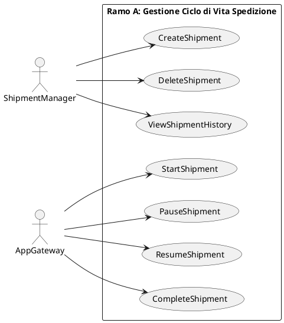
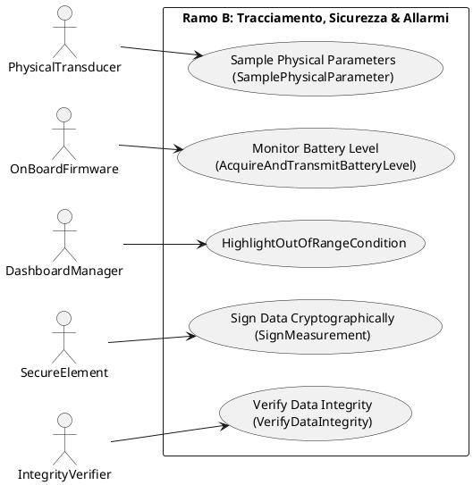
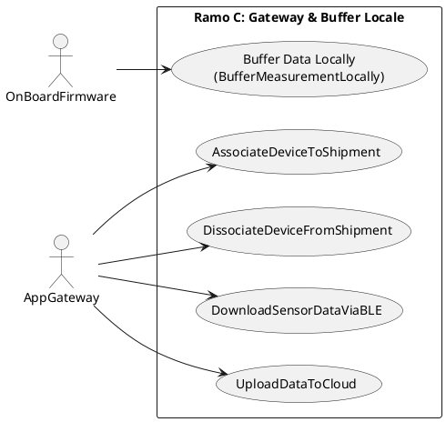
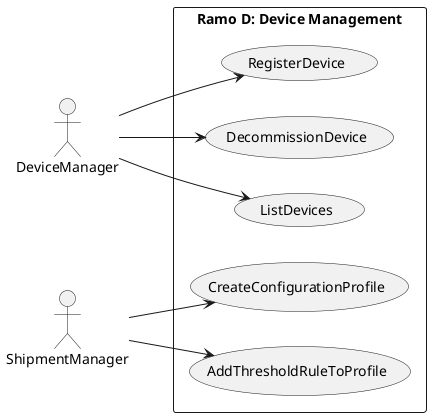

# REPORT DI PROGETTO: VISTA FUNZIONALE (DIAGRAMMI DEI CASI D'USO INGEGNERIZZATI)
## Corso di Ingegneria del Software - Università degli Studi di Verona

### 1. Inquadramento Metodologico della Vista Funzionale
In conformità con i canoni formali della metodologia **Goal-Oriented Requirements Engineering (GORE)** e le convenzioni strutturali dell'Ateneo scaligero, la **Vista Funzionale** (rappresentata tramite lo **Use Case Diagram**) descrive i servizi che il sistema To-Be rende disponibili per il soddisfacimento degli obiettivi strategici [12.5.1, 14.1].

Mentre il *Goal Model* risponde alla domanda sul *"Perché"* un sistema sia necessario e l' *Operation Model* specifica formalmente le precondizioni e le postcondizioni delle transizioni di stato [43, 70, 88], lo **Use Case Diagram** fornisce una vista di insieme, chiara e comprensibile anche a stakeholder non tecnici, di *"Cosa"* il sistema fa e di *"Chi"* interagisce con esso [12.5.1].

Nel contesto accademico di Verona, lo Use Case Diagram non viene impiegato come una generica collezione di storie utente, bensì come una rigorosa traduzione ad alto livello delle **Operazioni di Sistema** [12.5.1]. Per questa ragione, si applicano i seguenti vincoli di consistenza:
1. **Corrispondenza Biunivoca con l'Operation Model**: Ogni caso d'uso (ovale) deve corrispondere a una specifica operazione atomica definita nell'Operationalization Diagram [12.5.1, 14.2].
2. **Allineamento degli Attori con l'Agent Model**: Gli attori che interagiscono con i casi d'uso (stick figures) non sono semplici ruoli generici, ma rappresentano gli esatti **Agenti (software, fisici o umani)** a cui è stata assegnata la responsabilità dei leaf goal nel Capabilities Model [58, 12.5.1].
3. **Rigido Rispetto del Principio di Atomicità**: In linea con le precise indicazioni del docente, il diagramma **esclude categoricamente l'uso delle relazioni di `<<include>>` e `<<extend>>`** [12.5.1]. Essendo le operazioni di sistema concettualmente atomiche e non decomponibili in sotto-operazioni o varianti opzionali a questo livello di astrazione, l'introduzione di tali frecce risulterebbe in un errore formale [12.5.1].

---

### 2. Dizionario Formale degli Attori (Agenti)
Ogni attore coinvolto nei quattro rami funzionali è definito di seguito, garantendo la coerenza 1-to-1 con la **Vista delle Responsabilità (Agent Capabilities Report)** [1, 58]:

*   **DeviceManager (Agente Software)**: Componente del Cloud SaaS responsabile dell'onboarding, decommissioning e catalogazione diagnostica dei dispositivi hardware IoT [2, 80].
*   **ShipmentManager (Agente Software)**: Componente del Cloud SaaS deputato alla gestione amministrativa delle spedizioni (creazione, annullamento, consultazione dello storico) e alla definizione dei profili di soglia ambientale [2, 80].
*   **AppGateway (Agente Software - Smartphone)**: Applicazione mobile installata sul telefono dell'autista. Funge da gateway locale sul campo, gestendo l'associazione BLE dei sensori, le transizioni di viaggio reali e l'upload asincrono a Cloud [2, 61, 80].
*   **OnBoardFirmware (Agente Fisico/Ambientale - Sensore)**: Il firmware installato sul dispositivo IoT, responsabile della temporizzazione del campionamento, della scrittura in memoria flash locale (buffering) e della gestione BLE [2, 61, 80].
*   **PhysicalTransducer (Agente Fisico/Ambientale - Sensore)**: I componenti fisici del sensore (termistori, igrometri, accelerometri) che convertono i fenomeni ambientali reali in letture digitali [2, 61].
*   **SecureElement (Agente Fisico/Ambientale - Chip Crittografico)**: Il chip hardware sicuro a bordo del sensore (Secure Element) dedicato alle operazioni di firma crittografica asimmetrica alla sorgente [2, 61].
*   **IntegrityVerifier (Agente Software)**: Componente del Cloud SaaS responsabile della verifica della firma crittografica dei pacchetti dati in arrivo prima della loro persistenza [2].
*   **DashboardManager (Agente Software)**: Componente del Cloud SaaS deputato alla formattazione grafica della telemetria, alla gestione e scatenamento visivo degli allarmi (fuori soglia, manomissione, batteria scarica) [2, 61].

---

### 3. I 4 Rami Funzionali del Sistema (PlantUML)
Al fine di garantire la massima leggibilità strutturale ed evitare diagrammi monolitici eccessivamente complessi, la vista funzionale è stata scomposta in **quattro rami logico-funzionali indipendenti**, ciascuno direttamente tracciabile a uno specifico sotto-albero del Goal Model [71].

#### Ramo A: Gestione Ciclo di Vita Spedizione
Questo ramo modella i casi d'uso che governano l'evoluzione logica della spedizione. La modellazione riflette fedelmente la transizione di stato della variabile `logicalState` della classe Shipment [61].

#### Ramo B: Tracciamento, Sicurezza e Allarmi
Questo ramo esplicita l'interazione tra i componenti hardware e software dedicati alla catena di custodia sicura, evidenziando il ruolo del *Secure Element* e dell' *Integrity Verifier* [64, 80].

#### Ramo C: Gateway e Buffer Locale
Questo ramo descrive il comportamento asincrono del sistema e la gestione dei periodi di offline. Si noti come il buffering locale sia formalmente in capo all'OnBoardFirmware del sensore, mentre l'AppGateway gestisce l'upload asincrono [61, 80].

#### Ramo D: Device Management
Questo ramo descrive le attività amministrative di provisioning dei sensori hardware e di associazione/creazione dei relativi profili di soglia e campionamento [80].

---

### 4. Matrice di Consistenza Multivista Rigorosa
La seguente tabella costituisce la **prova formale di correttezza e consistenza inter-vista** del progetto [14.2, 58]. Dimostra che ogni singolo caso d'uso del diagramma è biunivocamente mappato sulle operazioni formali dell'Operation Model, sulle classi e gli attributi del Class Diagram e risponde direttamente a uno specifico leaf goal del Goal Model [58, 72, 88]:

| ID Caso d'Uso | Nome Caso d'Uso (Diagramma) | Agente Primario Associato | Operazione Formale Corrispondente | Classi e Attributi del Class Diagram Coinvolti | ID Goal Presidiato |
| :--- | :--- | :--- | :--- | :--- | :--- |
| **UC_CreateShip** | `CreateShipment` | **ShipmentManager** | `CreateShipment()` | `Shipment.logicalState = CREATED`, `Shipment.shipmentID` | **G5** [73] |
| **UC_DelShip** | `DeleteShipment` | **ShipmentManager** | `DeleteShipment()` | `Shipment.logicalState = CANCELLED` | **G5** [73] |
| **UC_ViewShip** | `ViewShipmentHistory` | **ShipmentManager** | `ViewShipmentHistory()` | `EnvironmentalMeasurement`, `Associazione tracked_by` | **G5** [73] |
| **UC_Start** | `StartShipment` | **AppGateway** | `StartShipment()` | `Shipment.logicalState = IN_TRANSIT` | **G6** [73] |
| **UC_Pause** | `PauseShipment` | **AppGateway** | `PauseShipment()` | `Shipment.logicalState = PAUSED` | **G6** [73] |
| **UC_Resume** | `ResumeShipment` | **AppGateway** | `ResumeShipment()` | `Shipment.logicalState = IN_TRANSIT` | **G6** [73] |
| **UC_Complete** | `CompleteShipment` | **AppGateway** | `CompleteShipment()` | `Shipment.logicalState = COMPLETED` | **G6** [73] |
| **UC_Sample** | `Sample Physical Parameters` | **PhysicalTransducer** | `SamplePhysicalParameter()` | `EnvironmentalMeasurement.measuredValue`, `TimeStamp` | **G11** [73] |
| **UC_Battery** | `Monitor Battery Level` | **OnBoardFirmware** | `AcquireAndTransmitBatteryLevel()` | `IoTDevice.batteryLevel` | **G7** [73] |
| **UC_Highlight** | `HighlightOutOfRangeCondition` | **DashboardManager** | `HighlightOutOfRangeCondition()` | `EnvironmentalMeasurement.isOutOfRange`, `AlarmNotification` | **G18** [73] |
| **UC_Sign** | `Sign Data Cryptographically` | **SecureElement** | `SignMeasurement()` | `CryptographicSignature.signatureValue` | **G10** [73] |
| **UC_Verify** | `Verify Data Integrity` | **IntegrityVerifier** | `VerifyDataIntegrity()` | `CryptographicSignature.integrityStatus` (VALID/INVALID) | **G14** [73] |
| **UC_Buffer** | `Buffer Data Locally` | **OnBoardFirmware** | `BufferMeasurementLocally()` | `IoTDevice.BufferMemory`, `Associazione samples` | **G9** [73] |
| **UC_Assoc** | `AssociateDeviceToShipment` | **AppGateway** | `AssociateDeviceToShipment()` | `Associazione tracked_by (0..1 ↔ 0..*)` | **G4** [73] |
| **UC_Dissoc** | `DissociateDeviceFromShipment` | **AppGateway** | `DissociateDeviceFromShipment()` | `Associazione tracked_by` (distruzione) | **G4** [73] |
| **UC_DL** | `DownloadSensorDataViaBLE` | **AppGateway** | `DownloadSensorDataViaBLE()` | `LocalGatewayBuffer.pendingPacketCount` | **G12** [73] |
| **UC_UL** | `UploadDataToCloud` | **AppGateway** | `UploadDataToCloud()` | `LocalGatewayBuffer.isCloudSynchronized` | **G13** [73] |
| **UC_RegDev** | `RegisterDevice` | **DeviceManager** | `RegisterDevice()` | `IoTDevice.hardwareID`, `IoTDevice.publicKey` | **G1** [73] |
| **UC_DecomDev** | `DecommissionDevice` | **DeviceManager** | `DecommissionDevice()` | `IoTDevice` (distruzione logica) | **G1** [73] |
| **UC_ListDev** | `ListDevices` | **DeviceManager** | `ListDevices()` | `IoTDevice.batteryLevel`, `BufferMemory`, `BLEConnectionStatus` | **G2** [73] |
| **UC_CreateConf** | `CreateConfigurationProfile` | **ShipmentManager** | `CreateConfigurationProfile()` | `ConfigurationProfile.ProfileID`, `samplingInterval` | **G3** [73] |
| **UC_AddThresh** | `AddThresholdRuleToProfile` | **ShipmentManager** | `AddThresholdRuleToProfile()` | `ThresholdRule` (istanza), `Associazione contains` | **G3** [73] |

---

### 5. Analisi del Pregio Architetturale e di Robustezza
L'attuale scomposizione e allineamento dei diagrammi dei casi d'uso evidenzia tre grandi scelte progettuali di valore accademico:

1.  **Risoluzione delle Scritture Concorrenti su `logicalState` (Ramo A)**:
    Sdoppiando le associazioni dei casi d'uso del ciclo di vita tra `ShipmentManager` (azioni amministrative sul Cloud) e `AppGateway` (transizioni reali sul campo generate dall'autista), il sistema garantisce che non vi siano sovrapposizioni o conflitti temporali di scrittura. Questo si traduce nella perfetta consistenza con le transizioni modellate nella **State Machine** [116].
2.  **Risoluzione dei Vincoli Fisici della Sincronizzazione BLE (Ramo C)**:
    Il diagramma esplicita graficamente che il sensore (tramite `OnBoardFirmware`) è l'unico deputato all'azione `Buffer Data Locally` quando non rileva dispositivi mobili [61]. Di riflesso, l'App mobile (`AppGateway`) è l'unica responsabile dello scaricamento (`DownloadSensorDataViaBLE`) e del caricamento asincrono (`UploadDataToCloud`), rispettando fedelmente le reali barriere di rete del dominio [61].
3.  **Atomicità e Assenza di Ridondanze Formali**:
    L'assenza intenzionale di relazioni `<<include>>` ed `<<extend>>` non costituisce una mancanza, bensì una **scelta metodologica rigorosa** [12.5.1]. Essendo le operazioni di sistema intrinsecamente atomiche (non ulteriormente decomponibili), mappare i casi d'uso a livello di singola transizione di stato preserva la solidità formale del modelo multivista impedendo l'over-specification e le incoerenze semantiche con l'Operation Model [12.5.1, 13.1.2].
