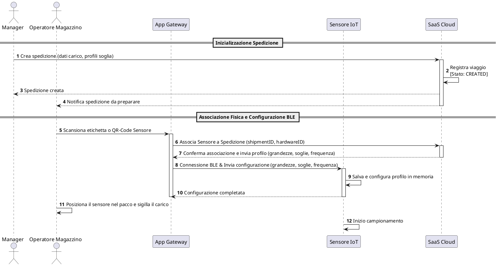
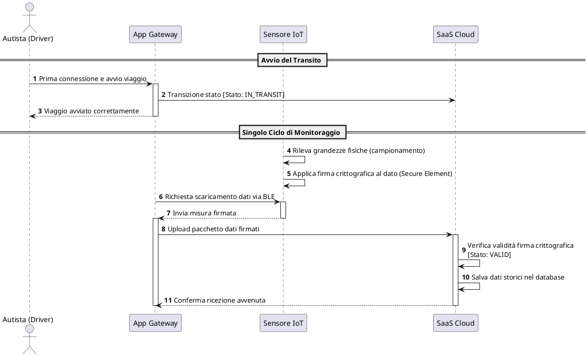
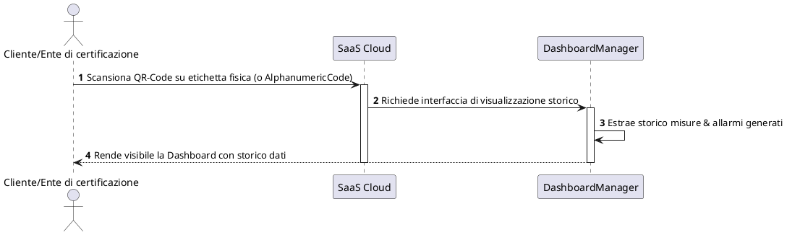

### REPORT DI PROGETTO: VISTA COMPORTAMENTALE AD ALTO LIVELLO
#### (DIAGRAMMI DI SEQUENZA PRE-INGEGNERIZZAZIONE)
##### Corso di Ingegneria del Software - Università degli Studi di Verona

---

###### 1. Inquadramento Metodologico dei Diagrammi di Sequenza ad Alto Livello
Nella metodologia **Goal-Oriented Requirements Engineering (GORE)** adottata presso l'Ateneo scaligero, i **Sequence Diagrams** (definiti anche **Event Trace Diagrams**) costituiscono la **Vista Comportamentale (Behavioral View)** del sistema [122, 148]. 

In una fase preliminare di analisi (fase *pre-ingegnerizzazione*), questi diagrammi hanno uno scopo prettamente **narrativo ed euristico** [123, 203]:
*   **Dialogo con gli Stakeholder**: Fungono da ponte tra i requisiti informali espressi in linguaggio naturale e la specifica formale delle operazioni, catturando sequenze tipiche di interazione in scenari positivi (*happy paths*) [123, 209].
*   **Astrazione e Incapsulamento**: Rappresentano i componenti software principali come macro-blocchi (es. il backend Cloud come una scatola nera "SaaS Cloud") ed escludono i dettagli crittografici o architetturali più minuti, che saranno sviscerati solo successivamente nell'Operation Model [123, 203].
*   **Definizione del Chi (Chi fa Cosa)**: Consentono di mappare con estrema chiarezza il confine del sistema, separando gli **attori umani** esterni (che innescano fisicamente gli eventi) dalle **componenti tecnologiche** (software e hardware) del mondo reale *To-Be* [123, 159].

---

###### 2. Definizione Rigorosa delle Lifelines (Attori e Componenti)
Per garantire che i diagrammi di sequenza siano pienamente autoconsistenti ed intellegibili, si definiscono rigorosamente di seguito tutte le **Lifelines** coinvolte prima della rappresentazione dei flussi [123, 185]:

####### 2.1. Attori Umani (Agenti Esterni)
*   **Manager**: L'utente amministrativo di alto livello della piattaforma. Gestisce le spedizioni in ufficio, definendo i lotti di merce fragile, le regole di soglia termica/meccanica e controllando lo stato complessivo dei trasporti dal portale web.
*   **Operatore Magazzino**: L'addetto alla logistica presente fisicamente nel centro di spedizione. Si occupa del confezionamento dei colli, della scansione dei codici identificativi per l'onboarding e del posizionamento dei sensori IoT all'interno dei pacchi prima della partenza.
*   **Autista (Driver)**: Il conducente del mezzo di trasporto incaricato della movimentazione delle merci fragili lungo la tratta. Interagisce col sistema esclusivamente tramite l'interfaccia dell'applicazione mobile.
*   **Cliente / Ente di Certificazione**: Il destinatario finale della spedizione fragile o l'ispettore terzo dell'autorità di qualità. Deve poter verificare la catena di custodia e conformità del viaggio scansionando l'etichetta del pacco all'arrivo, accedendo alla visualizzazione dei dati senza credenziali di login.

####### 2.2. Componenti del Sistema (System-to-Be) e dell'Ambiente
*   **App Gateway (Software Agent - System-to-Be)**: L'applicazione mobile installata sul telefono dell'autista. Agisce come gateway intelligente sul campo: rileva i sensori via BLE, scarica le letture nel buffer locale e le carica asincronamente sul Cloud.
*   **Sensore IoT (Environment Agent - Hardware/Firmware)**: Il dispositivo fisico commerciale low-cost posizionato all'interno delle merci, contenente il firmware di controllo (**OnBoardFirmware**), i trasduttori di misurazione (**PhysicalTransducer**) e il coprocessore crittografico (**SecureElement**).
*   **SaaS Cloud (Software Agent - System-to-Be)**: L'infrastruttura centrale erogata come servizio (SaaS). Coordina i database storici, memorizza i dati anagrafici dei viaggi, verifica matematicamente le firme e serve le dashboard web.
*   **DashboardManager (Software Agent - Cloud Sub-Component)**: Sotto-componente specifico del SaaS Cloud dedicato alla gestione dell'allarmistica, del controllo accessi degli stakeholder e del rendering grafico interattivo della dashboard.

---

###### 3. Diagramma di Sequenza 1: Inizializzazione, Onboarding e Partenza (CREATED)
Questo scenario descrive la fase preparatoria della spedizione. Evidenzia la separazione dei ruoli tra l'azione amministrativa del **Manager** e l'operatività sul campo dell'**Operatore di Magazzino**, culminando nella configurazione BLE e nel sigillo del pacco.

**Logica del Flusso**:
1.  Il **Manager** crea la spedizione impostandone a sistema le regole di soglia; il Cloud registra l'istanza in stato logico iniziale `CREATED` [216].
2.  L'**Operatore di Magazzino** riceve la notifica e scansiona l'etichetta ottica della spedizione e il codice a barre del sensore.
3.  L'**App Gateway** invia la richiesta di associazione al Cloud (istanziando la relazione `tracked_by` del Class Diagram) [134, 220].
4.  L'**App Gateway** riceve dal Cloud le regole del profilo termico/meccanico e le spara al **Sensore IoT** tramite protocollo Bluetooth Low Energy (BLE), configurando l'hardware prima che il pacco venga chiuso ereticamente.

---

###### 4. Diagramma di Sequenza 2: Tracciamento e Sincronizzazione in Transito (IN_TRANSIT)
Questo scenario descrive il comportamento dinamico in transito, evidenziando il campionamento, la firma crittografica alla sorgente, lo scaricamento automatico BLE e l'upload asincrono sul Cloud.

**Logica del Flusso**:
1.  All'avvio del trasporto, l'**Autista** preme "Avvia Viaggio": l'**App Gateway** invia il segnale al Cloud che fa transitare lo stato logico di `Shipment` a `IN_TRANSIT` [216, 272].
2.  Il **Sensore IoT** rileva autonomamente le grandezze fisiche (temperatura, umidità, urti) tramite i propri trasduttori e blinda matematicamente il pacchetto dati tramite la chiave privata del **SecureElement** [225].
3.  L'**App Gateway** si collega periodicamente a corto raggio via BLE con il sensore, prelevando le misure e le firme crittografiche (svuotando il buffer del sensore) [218].
4.  L'**App Gateway** esegue l'upload asincrono del pacchetto dati non appena rileva connettività internet (4G/5G).
5.  Il **SaaS Cloud** verifica matematicamente l'hash del pacchetto tramite la chiave pubblica del dispositivo e, verificatane l'integrità (`integrityStatus = VALID`), lo scrive in modo persistente sul database storico [217, 226].

---

###### 5. Diagramma di Sequenza 3: Consultazione Pubblica (Ispezione Destinatario)
Questo scenario descrive l'ispezione finale della conformità della catena di custodia. Mostra l'utente finale (o un ispettore terzo) che accede ai dati certificati e storici visualizzando la Live-Dashboard.

**Logica del Flusso**:
1.  Il **Cliente / Ispettore** scansiona il QR Code stampato sulla lettera di vettura incollata al collo (o inserisce manualmente l'**AlphanumericCode** se il QR è illeggibile) [119, 134].
2.  La richiesta perviene al **SaaS Cloud**, che contatta l'agente **DashboardManager** delegato a servire l'interfaccia [119, 137].
3.  Il **DashboardManager** estrae lo storico delle telemetrie e degli allarmi (es. batteria scarica, sforamento soglia o manomissione di firma) e serve la pagina web interattiva direttamente all'utente finalizzando la verifica di idoneità del lotto merci.

---

###### 6. Matrice di Consistenza Inter-Vista (Allineamento dei Requisiti)
In conformità con le direttive del Professor Ceccato, la tabella seguente costituisce la **prova formale di consistenza** del modello multi-vista [127, 141]. Essa mappa i messaggi descrittivi ed operativi in lingua italiana usati nei diagrammi di sequenza sulle specifiche formali in lingua inglese stabilite nelle classi, nelle capacità degli agenti e nelle operazioni [127, 141].

| ID Messaggio | Nome Messaggio (Sequence) | Agente Mittente | Agente Destinatario | Operazione Formale Corrispondente | Attributi / Associazioni Class Diagram Coinvolti |
| :--- | :--- | :--- | :--- | :--- | :--- |
| **M1** | `Crea spedizione` | *Manager (Umano)* | `ShipmentManager` | `CreateShipment()` | `Shipment.logicalState = CREATED`, `shipmentID` |
| **M2** | `Associa Sensore a Spedizione` | `AppGateway` | `ShipmentManager` | `AssociateDeviceToShipment()` | Associazione `tracked_by` |
| **M3** | `Invia configurazione` | `AppGateway` | `OnBoardFirmware` | `CreateConfigurationProfile()` / `AddThresholdRuleToProfile()` | `ConfigurationProfile.samplingInterval`, `ThresholdRule` |
| **M4** | `Transizione stato IN_TRANSIT` | `AppGateway` | `ShipmentManager` | `StartShipment()` | `Shipment.logicalState = IN_TRANSIT` |
| **M5** | `Rileva grandezze fisiche` | `PhysicalTransducer` | `OnBoardFirmware` | `SamplePhysicalParameter()` | `EnvironmentalMeasurement.measuredValue`, `TimeStamp` |
| **M6** | `Applica firma crittografica` | `SecureElement` | `OnBoardFirmware` | `SignMeasurement()` | `CryptographicSignature.signatureValue`, `integrityStatus` |
| **M7** | `Richiesta scaricamento` | `AppGateway` | `OnBoardFirmware` | `DownloadSensorDataViaBLE()` | `LocalGatewayBuffer.pendingPacketCount` |
| **M8** | `Upload pacchetto` | `AppGateway` | `IntegrityVerifier` | `UploadDataToCloud()` | `LocalGatewayBuffer.isCloudSynchronized` |
| **M9** | `Verifica validità` | `IntegrityVerifier` | `IntegrityVerifier` | `VerifyDataIntegrity()` | `CryptographicSignature.integrityStatus = VALID` |
| **M10**| `Richiede interfaccia` | `APIManager` / *Client* | `DashboardManager` | `RenderProfilatedDashboard()` | `EnvironmentalMeasurement`, `AlarmNotification` |
| **M11**| `Scansiona QR-Code` | *Client (Umano)* | `APIManager` | `AccessDashboardViaAlphanumericCode()` | `ShippingLabel.AlphanumericCode`, `QrCodeURL` |

---

###### 7. Assunzioni Comportamentali di Dominio (Domain Assumptions)
Affinché gli scenari comportamentali sopra descritti abbiano successo a livello fisico, il sistema assume la correttezza di specifici comportamenti umani o costanti ambientali che non possono essere imposti via codice software, ma che rappresentano vincoli contrattuali essenziali per la robustezza dell'intera catena di custodia [294]:

*   **ASM1 (Operator Trust & Physical Pairing)**: Si assume che l'Operatore di Magazzino esegua l'associazione ottica del sensore corretto prima di sigillare l'imballaggio della merce. Un inserimento di dati errati (es. associare il sensore A ma inserire fisicamente il sensore B nel box) inficerebbe la validità del tracciamento.
*   **ASM2 (Driver Proximity)**: Si assume che l'Autista mantenga il Bluetooth attivo sul proprio smartphone e che l'applicazione Gateway sia in esecuzione in background per tutta la durata del trasporto. Si assume inoltre che l'autista si trovi entro la portata radio BLE del carico (tipicamente < 10 metri) con una frequenza sufficiente a svuotare il buffer di memoria del sensore prima della saturazione fisica del chip.
*   **ASM3 (Device Protection)**: Si assume che il sensore sia collocato all'interno del vano in un imballaggio protettivo impermeabile che lo schermi da urti diretti o infiltrazioni di umidità che potrebbero danneggiare la batteria o i circuiti di trasmissione prima della consegna della spedizione.
