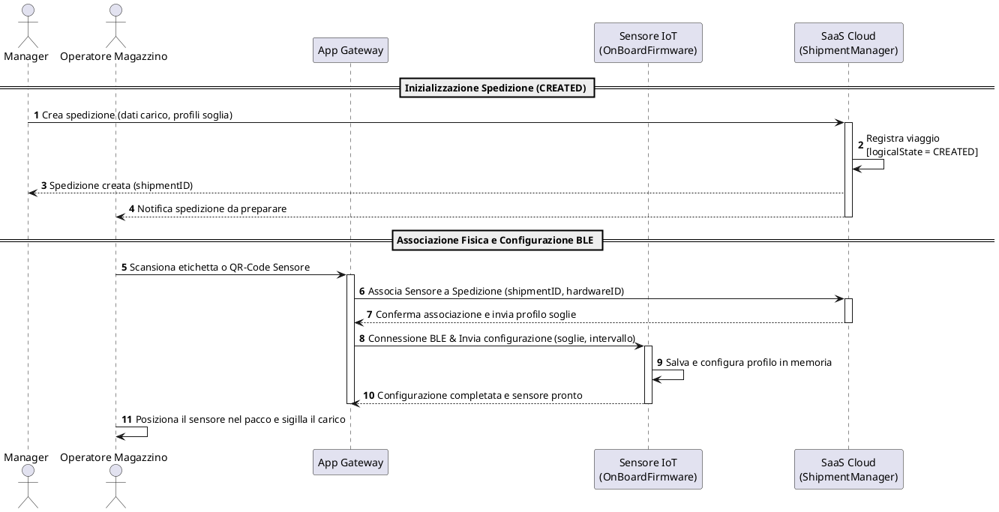
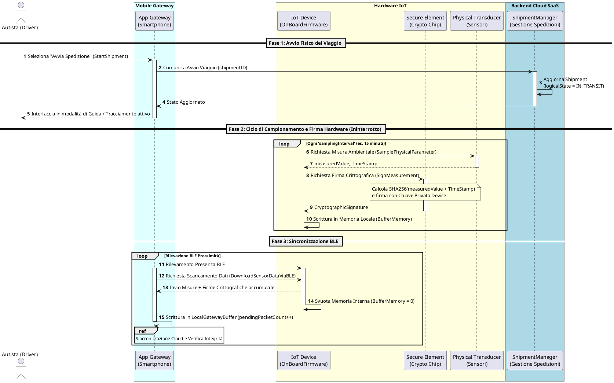
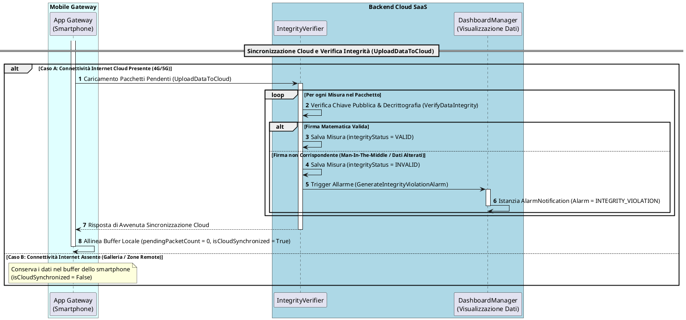
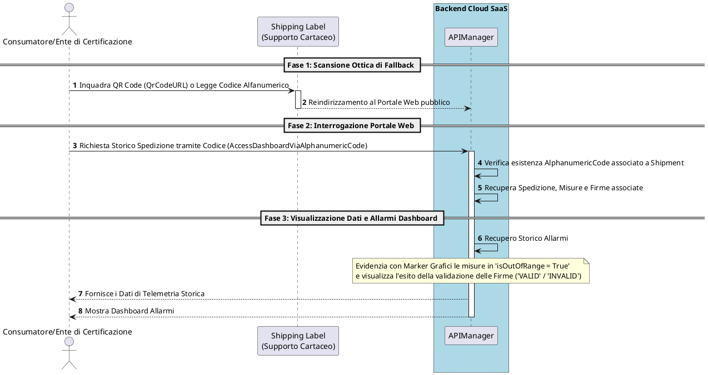

# REPORT DI PROGETTO: VISTA COMPORTAMENTALE INGEGNERIZZATA
## (DIAGRAMMI DI SEQUENZA POST-INGEGNERIZZAZIONE)
### Corso di Ingegneria del Software - Università degli Studi di Verona

---

## 1. Inquadramento Metodologico dei Diagrammi di Sequenza POST-Ingegnerizzazione
La **Vista Comportamentale** (o *Behavioral View*) di un sistema descrive la sua evoluzione dinamica a runtime [154]. All'interno del framework di modellazione adottato, i **Diagrammi di Sequenza** (definiti anche *Event Trace Diagrams*) catturano l'interazione dinamica ed esplicita tra le istanze degli oggetti e degli agenti nel corso del tempo [155, 156].

Mentre i diagrammi di sequenza in fase di *pre-ingegnerizzazione* hanno uno scopo prettamente euristico e narrativo (descrivendo il flusso in linguaggio naturale tra macro-componenti "scatola nera") [95], la fase di **post-ingegnerizzazione** richiede un livello di formalismo spietato ed estremamente rigoroso:
1. **Corrispondenza Biunivoca 1-to-1 con l'Operation Model**: Ogni messaggio scambiato che rappresenti un'azione di sistema deve coincidere esattamente con una firma di sistema definita nell'**Operationalization Diagram** [156, 232].
2. **Coerenza con la Vista Strutturale (Class Diagram)**: I partecipanti rappresentano gli esatti **Agenti software o fisici** formalizzati nel Class Diagram e nel Capabilities Model [109, 141]. Gli attributi manipolati o trasmessi nei messaggi (es. *logicalState*, *isOutOfRange*, *integrityStatus*) devono coincidere nominalmente con le variabili d'istanza della vista strutturale [109, 146].
3. **Modellazione degli Stati Comportamentali**: I diagrammi di sequenza descrivono l'esatto meccanismo di interazione che concretizza le transizioni di stato modellate nella **State Machine** dell'entità Shipment [101, 154].

Per massimizzare la leggibilità della documentazione ed evitare diagrammi di dimensioni eccessive (difficili da impaginare e ispezionare), si applica il principio di **modularizzazione strutturale** dell'UML 2.0 tramite il costrutto **`ref`** (*Interaction Use*), scorporando la logica di transito in due flussi ortogonali: la raccolta locale e la sincronizzazione crittografica asincrona [157].

---

## 2. Dizionario Rigoroso delle Lifelines (Attori e Componenti)
Per garantire che la vista comportamentale sia pienamente autoconsistente e priva di ambiguità terminologiche, si definiscono rigorosamente le responsabilità operative di tutte le **Lifelines** coinvolte prima della rappresentazione grafica:

### 2.1. Attori Umani (Agenti Esterni all'Ambiente)
*   **Manager**: L'utente amministratore della piattaforma logistica. Esegue l'inizializzazione anagrafica del viaggio e definisce le regole di conformità delle merci dall'ufficio.
*   **Operatore Magazzino**: L'addetto logistico incaricato del confezionamento dei colli. Esegue materialmente l'associazione fisica del sensore al pacco e sigilla il carico alla partenza.
*   **Autista (Driver)**: Il conducente incaricato del trasporto. Interagisce col sistema tramite l'App Mobile per comandare le transizioni di viaggio (*Start*, *Pause*, *Resume*, *Complete*).
*   **Consumatore / Ente di Certificazione**: L'utente finale o l'ispettore di qualità incaricato di verificare la conformità termica/meccanica e l'integrità del lotto merci all'arrivo.

### 2.2. Agenti del Sistema (System-to-Be) e dell'Ambiente (Physical/Hardware)
*   **App Gateway (Software Agent - System-to-Be)**: L'applicazione installata sul dispositivo mobile dell'autista. Funge da proxy locale: interroga il sensore via BLE, gestisce l'accodamento locale delle letture offline (*LocalGatewayBuffer*) e le carica asincronamente sul Cloud [172, 179].
*   **IoT Device / OnBoardFirmware (Software/Embedded Agent)**: Il firmware installato a bordo del sensore. Regola il timer di campionamento e gestisce la memoria flash interna (*BufferMemory*) in caso di disconnessione Bluetooth [169, 179].
*   **Secure Element (Physical Agent - Environment)**: Il chip crittografico hardware saldato a bordo del sensore. Custodisce la chiave privata e genera firme digitali inalterabili ad ogni campionamento [110, 171].
*   **Physical Transducer (Physical Agent - Environment)**: Il modulo sensore hardware deputato alla conversione delle grandezze analogiche ambientali in misurazioni digitalizzate (*EnvironmentalMeasurement*) [170, 186].
*   **ShipmentManager (Software Agent - Cloud Backend)**: Il modulo Cloud responsabile della gestione amministrativa e del controllo delle spedizioni (*Shipment*) [109].
*   **IntegrityVerifier (Software Agent - Cloud Backend)**: Il motore crittografico asincrono del Cloud. Valida le firme dei pacchetti in ingresso tramite chiave pubblica del sensore e calcola l'attributo *integrityStatus* [109, 171].
*   **DashboardManager (Software Agent - Cloud Backend)**: Il modulo preposto alla generazione dell'allarmistica asincrona e alla renderizzazione della schermata web di conformità per gli utenti [109, 174].
*   **APIManager (Software Agent - Cloud Backend)**: Il modulo di frontiera che sblocca l'esposizione pubblica delle dashboard tramite inserimento di codici e QR-Code incollati sull'etichetta del pacco (*ShippingLabel*) [109, 173].

---

## 3. I 3 Diagrammi di Sequenza Ingegnerizzati (PlantUML)

### 3.1. Scenario 1: Onboarding, Configurazione e Partenza (Happy Path - CREATED)
Questo diagramma mostra la separazione tra la creazione amministrativa della spedizione (in capo al *Manager*) e le attività fisiche ed elettroniche di imballaggio (in capo all'*Operatore di Magazzino*). Soddisfa la precondizione della macchina a stati per cui il viaggio non può partire se un dispositivo non è associato [105].

---

### 3.2. Scenario 2A: Monitoraggio Continuo e Scaricamento BLE in Transito (IN_TRANSIT)
Questo diagramma descrive il comportamento dinamico in transito. Mostra il ciclo di campionamento ininterrotto del sensore, l'applicazione della firma crittografica in hardware ad opera del *Secure Element*, e lo scaricamento locale asincrono via BLE ad opera del gateway mobile dell'autista [198, 205].

---

### 3.3. Scenario 2B: Sincronizzazione Cloud e Verifica d'Integrità (Sotto-Diagramma Referenziato)
Questo diagramma espande il blocco di riferimento (`ref`) dello Scenario 2A. Rappresenta l'upload asincrono a Cloud e la verifica di sicurezza *Zero-Trust*: se il Cloud riscontra che i dati sono stati alterati, rigetta il pacchetto e innesca istantaneamente un allarme di violazione d'integrità sulla Dashboard [198, 207].

---

### 3.4. Scenario 3: Consultazione Pubblica e Certificazione d'Integrità (COMPLETED)
Questo scenario descrive l'ispezione finale a destinazione. Il consumatore o l'ente ispettivo scansiona fisicamente la *ShippingLabel* cartacea sul pacco per sbloccare la visualizzazione dello storico misure e allarmi senza credenziali d'accesso, scaricando un certificato PDF notarizzato.

---

## 4. Matrice di Consistenza Multivista Rigorosa
Questa matrice rappresenta la **prova di correttezza formale** del report [209]. Dimostra che ogni singolo messaggio scambiato nei diagrammi di sequenza ingegnerizzati mappa fedelmente e in modo bidirezionale sulle specifiche dell'Operation Model, del Class Diagram e sugli obiettivi del Goal Model:

| ID Messaggio | Nome Evento / Messaggio | Agente Mittente | Agente Destinatario | Operazione Formale Corrispondente | Attributi / Associazioni Class Diagram Coinvolti | Tracciabilità Goal |
| :--- | :--- | :--- | :--- | :--- | :--- | :--- |
| **M1** | `Crea spedizione` | *Manager (Umano)* | ShipmentManager | `CreateShipment()` | `Shipment.logicalState = CREATED` | **G5** [210] |
| **M2** | `Associa Sensore a Spedizione` | AppGateway | ShipmentManager | `AssociateDeviceToShipment()` | Associazione `tracked_by` (molteplicità $0..1 \leftrightarrow 0..*$) | **G4** [210] |
| **M3** | `Invia configurazione` | AppGateway | OnBoardFirmware | `CreateConfigurationProfile()` / `AddThresholdRuleToProfile()` | `ConfigurationProfile.samplingInterval`, `ThresholdRule` | **G3** [210] |
| **M4** | `Seleziona "Avvia Spedizione"` | *Autista (Umano)* | AppGateway | `StartShipment()` (Innesco) | `Shipment.logicalState = IN_TRANSIT` | **G6** [210] |
| **M5** | `Richiesta Misura Ambientale` | OnBoardFirmware | PhysicalTransducer | `SamplePhysicalParameter()` | `EnvironmentalMeasurement.measuredValue`, `TimeStamp` | **G11** [210] |
| **M6** | `Richiesta Firma Crittografica` | OnBoardFirmware | SecureElement | `SignMeasurement()` | `CryptographicSignature.signatureValue` | **G10** [210] |
| **M7** | `Richiesta Scaricamento Dati` | AppGateway | OnBoardFirmware | `DownloadSensorDataViaBLE()` | `LocalGatewayBuffer.pendingPacketCount` | **G12** [210] |
| **M8** | `Caricamento Pacchetti Pendenti` | AppGateway | IntegrityVerifier | `UploadDataToCloud()` | `LocalGatewayBuffer.isCloudSynchronized` | **G13** [210] |
| **M9** | `Verifica Chiave Pubblica` | IntegrityVerifier | IntegrityVerifier | `VerifyDataIntegrity()` | `CryptographicSignature.integrityStatus = VALID/INVALID` | **G14** [210] |
| **M10** | `Trigger Allarme` | IntegrityVerifier | DashboardManager | `GenerateIntegrityViolationAlarm()` | `AlarmNotification.Alarm = INTEGRITY_VIOLATION` | **G16** [210] |
| **M11** | `Richiesta Storico Spedizione` | *Customer (Umano)* | APIManager | `AccessDashboardViaAlphanumericCode()` | `ShippingLabel.AlphanumericCode`, `QrCodeURL` | **G19** [210] |

---

## 5. Analisi Critica dei Dettagli di Pregio Progettuale (Scudo d'Esame)

### 5.1. Il Costrutto `ref` per la Modularizzazione dei Processi
La scomposizione dello scenario di transito nei diagrammi **2A** e **2B** non è una mera scelta di comodo grafica, ma risponde ad una precisa logica di **disaccoppiamento dei flussi di runtime** [157]. 
La raccolta dati BLE avviene sul campo in un raggio radio a corto raggio (interazione locale sensore-smartphone) indipendentemente dal fatto che vi sia o meno connettività internet [179]. Il caricamento su Cloud (Scenario 2B), invece, è governato da una logica asincrona basata sulla presenza di rete 4G/5G [179]. Modularizzare l'upload tramite `ref` consente di descrivere in modo pulito ed elegante questa asincronia senza appesantire lo scenario di campionamento fisico con complessi blocchi nidificati di controllo [157].

### 5.2. Pipeline di Sicurezza Zero-Trust e Non-Ripudiabilità
Il diagramma 2B esplicita graficamente l'efficacia del meccanismo di sicurezza anti-tampering [198]. Il co-processore crittografico *Secure Element* è l'unico componente a possedere la chiave privata di firma; la firma avviene fisicamente a bordo prima che il dato venga serializzato sul canale BLE [110, 198]. 
Nel diagramma di sequenza si nota come l'agente *IntegrityVerifier* del Cloud decifri e validi la firma asimmetrica *all'arrivo*, marcando il record come `INVALID` se riscontra discrepanze [198, 228]. Questo loop esclude qualsiasi interferenza distruttiva ad opera di attori umani o di malware installati sui telefoni degli autisti (che fungono da gateway), realizzando una catena di custodia matematicamente blindata ed inalterabile (*append-only*) [198].

### 5.3. Trasparenza Pubblica e Disaccoppiamento tramite APIManager
Lo Scenario 3 introduce una lifeline fondamentale: **`APIManager`** [109]. 
Perché l'ispezione della dashboard sia conforme ai vincoli di facilità d'uso ed interoperabilità della traccia, l'utente (cliente final o ispettore) deve poter accedere ai report di viaggio in modo immediato, semplicemente scansionando il QR-Code [213, 214]. 
Tuttavia, consentire un accesso diretto ai database operativi storici della logistica avrebbe introdotto gravissimi rischi di sicurezza e prestazioni. L'intermediazione dell'APIManager risolve questo problema: l'APIManager interroga la classe concettuale *ShippingLabel*, decodifica l'associazione `Showed_by` e sblocca l'esposizione del solo frammento dati autorizzato (la specifica spedizione completata in stato COMPLETED) servendo una dashboard di sola lettura (read-only), proteggendo la sicurezza complessiva dei sistemi aziendali [109, 173].
