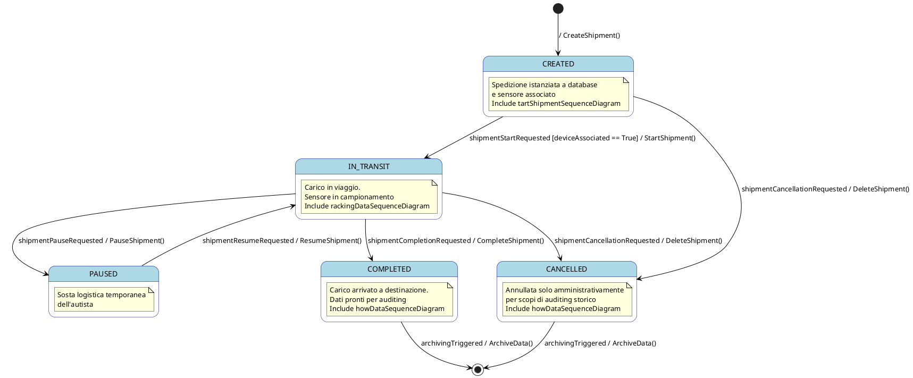

# Report Formale della Vista Comportamentale: Macchina a Stati della Spedizione (`Shipment`)

## 1. Inquadramento Metodologico

La **Vista Comportamentale** del sistema ha lo scopo di descrivere l'evoluzione dinamica e temporale delle entità chiave che ne costituiscono lo stato interno. Mentre i diagrammi di interazione (come i Sequence Diagrams) si focalizzano sullo scambio di messaggi tra i vari componenti e attori, lo **State Machine Diagram (Macchina a Stati)** adotta una prospettiva *incentrata sull'oggetto (object-centric)*. 

Nel presente progetto, l'entità principale che governa l'intero dominio applicativo è la **Spedizione (`Shipment`)**. Il suo comportamento temporale è descritto formalmente attraverso i cambiamenti di stato dell'attributo di sistema **`logicalState`**, definito all'interno del *Class Diagram* e vincolato dalle formule di precondizione e postcondizione dell'*Operationalization Diagram*.

### Distinzione Chiave: State Machine vs. Activity Diagram
Al fine di evitare ambiguità formali, è essenziale distinguere la Macchina a Stati da un diagramma delle attività (Activity Diagram):
*   **State Machine (Reattiva)**: Modella il ciclo di vita di un singolo oggetto. Le transizioni tra gli stati non sono automatiche, ma sono **reattive**, ovvero avvengono esclusivamente in risposta a stimoli ed eventi esterni (invocati da attori o agenti software) a patto che siano soddisfatte determinate condizioni di guardia. L'entità permane in un determinato stato per un tempo indefinito finché non viene sollecitata.
*   **Activity Diagram (Procedurale)**: Modella un flusso di controllo sequenziale o parallelo di azioni (flowchart). Le transizioni sono automatiche e avvengono non appena l'azione precedente giunge al termine.

La modellazione qui presentata si attiene rigorosamente allo standard delle macchine a stati UML, legando deterministicamente ogni transizione a un'operazione del sistema (*System Operation*).

---

## 2. Definizione del Ciclo di Vita e degli Stati della Spedizione

La spedizione attraversa cinque stati logici nominali, oltre ai punti di attivazione iniziale e disattivazione finale (archiviazione):

1.  **Stato Iniziale $(\bullet)$**: Rappresenta la fase di pre-esistenza della spedizione. L'entità non è ancora istanziata a sistema.
2.  **`CREATED` (Inizializzato)**: La spedizione è stata creata amministrativamente a database tramite l'operazione `CreateShipment()`. In questa fase, il viaggio non è ancora iniziato, ma il sistema consente all'operatore di magazzino di associare e configurare il sensore IoT specifico per quel lotto di merci.
3.  **`IN_TRANSIT` (In Viaggio)**: Rappresenta la fase operativa di trasporto. Il carico è fisicamente in viaggio sul veicolo e il sensore IoT esegue il campionamento continuo e sicuro delle grandezze fisiche ambientali.
4.  **`PAUSED` (In Pausa)**: Stato di sosta logistica programmata o di emergenza. Viene invocato dall'autista (es. soste notturne, controlli doganali, cambio del mezzo di trasporto). Durante la pausa, i sensori continuano a registrare le misurazioni per garantire la catena di custodia, ma il sistema riconosce formalmente che il viaggio è momentaneamente fermo.
5.  **`CANCELLED` (Annullato)**: Stato di terminazione anomala o amministrativa. Una spedizione può essere annullata sia prima della partenza (stato `CREATED`) sia durante il trasporto (stato `IN_TRANSIT`) qualora sopraggiungano anomalie (es. deterioramento preventivo della merce, revoca dell'ordine). I dati accumulati fino al momento dell'annullamento vengono comunque preservati a sistema per scopi di auditing storico.
6.  **`COMPLETED` (Completato)**: Stato di terminazione nominale (Happy Path). Rappresenta il successo della spedizione, avvenuta con la consegna fisica del lotto a destinazione. Il ciclo di monitoraggio si chiude e i dati d'integrità sono pronti per l'auditing finale da parte del cliente o degli enti ispettivi.
7.  **Stato Finale $(\odot)$**: Rappresenta l'archiviazione logica della spedizione. Una volta transitati nello stato finale tramite l'azione di storicizzazione, i dati diventano di sola consultazione (sola lettura) e non possono più subire transizioni attive.

---

## 3. Diagramma della Macchina a Stati (Codice PlantUML)

Di seguito viene riportato il codice formale **PlantUML** per la generazione del diagramma di transizione di stato dell'entità `Shipment`:

---

## 4. Analisi Dettagliata delle Transizioni, Guardie e Operazioni

Ogni transizione della macchina a stati rispetta la sintassi formale standard:
$$\text{Evento} \ [\text{Condizione di Guardia}] \ / \ \text{Operazione di Sistema}$$

### Tabella Formalizzata delle Transizioni

| Stato di Partenza | Stato di Arrivo | Evento Scatenante | Condizione di Guardia ($[\text{Guard}]$) | Operazione di Sistema ($/ \text{Azione}$) | Effetto sul Database e Variabili |
| :--- | :--- | :--- | :--- | :--- | :--- |
| **$[*]$** | **`CREATED`** | `shipmentCreationRequested` | - | `CreateShipment()` | Alloca l'entità `Shipment` nel database e imposta `logicalState = CREATED`. |
| **`CREATED`** | **`CANCELLED`** | `shipmentCancellationRequested` | - | `DeleteShipment()` | Revoca la spedizione prima della partenza. Modifica lo stato in `CANCELLED`. |
| **`IN_TRANSIT`**| **`CANCELLED`** | `shipmentCancellationRequested` | - | `DeleteShipment()` | Revoca la spedizione a viaggio in corso. Modifica lo stato in `CANCELLED`. |
| **`CREATED`** | **`IN_TRANSIT`**| `shipmentStartRequested` | `[deviceAssociated == True]` | `StartShipment()` | Consente la partenza solo se un sensore è accoppiato. Modifica lo stato in `IN_TRANSIT`. |
| **`IN_TRANSIT`**| **`PAUSED`** | `shipmentPauseRequested` | - | `PauseShipment()` | Mette in pausa il conteggio dei tempi di viaggio. Modifica lo stato in `PAUSED`. |
| **`PAUSED`** | **`IN_TRANSIT`**| `shipmentResumeRequested` | - | `ResumeShipment()` | Riprende il normale monitoraggio attivo. Ripristina lo stato a `IN_TRANSIT`. |
| **`IN_TRANSIT`**| **`COMPLETED`** | `shipmentCompletionRequested`| - | `CompleteShipment()` | Chiude nominalmente il trasporto. Disassocia il sensore e imposta lo stato a `COMPLETED`. |
| **`COMPLETED`** | **$[*]$** | `archivingTriggered` | - | `ArchiveData()` | Rende storici e immutabili i log della spedizione. |
| **`CANCELLED`** | **$[*]$** | `archivingTriggered` | - | `ArchiveData()` | Rende storici e immutabili i log della spedizione annullata. |

---

## 5. Evidenze di Pregio Progettuale e Coerenza Inter-Vista

L'architettura della macchina a stati evidenzia alcune scelte di modellazione avanzate che garantiscono l'assoluta robustezza dell'intero progetto:

1.  **La Doppia Via di Cancellazione (`DeleteShipment`)**:
    In perfetta conformità con le precondizioni logiche stabilite nell'**Operationalization Diagram** (dove il dominio di validità della cancellazione richiede che la spedizione non sia ancora completata), l'operazione `DeleteShipment()` è invocabile sia dallo stato `CREATED` sia dallo stato `IN_TRANSIT`. Ciò risponde a scenari reali in cui una spedizione in corso subisce incidenti o revoke commerciali improvvise.
2.  **La Guardia di Associazione (`[deviceAssociated == True]`)**:
    Questa condizione di guardia rappresenta una misura di sicurezza e robustezza procedurale fondamentale. Impedisce all'autista di avviare fisicamente il viaggio sul camion (`StartShipment()`) se l'operatore di magazzino non ha prima eseguito l'associazione fisica del sensore IoT al carico (`deviceAssociated == True`). Questa guardia assicura che non esistano viaggi "non monitorati", azzerando il risco di spedizioni sprovviste di tracciamento continuo della catena di custodia.
3.  **Gestione dello Stato di Pausa (`PAUSED`)**:
    La transizione verso `PAUSED` è limitata allo stato `IN_TRANSIT`. Qualora il manager debba procedere all'annullamento della spedizione durante una pausa logistica dell'autista, la macchina a stati impone la transizione di ripresa (`ResumeShipment()`) per riportare il sistema in transito prima di procedere alla cancellazione. Questa scelta evita la proliferazione di transizioni ridondanti da `PAUSED` a `CANCELLED`, mantenendo snello e pulito il modello matematico dei requisiti pur preservando la totale copertura di tutti gli scenari operativi.
4.  **Storicizzazione e Conservazione delle Prove (Auditing)**:
    Sia la conclusione nominale (`COMPLETED`) sia l'annullamento (`CANCELLED`) non eliminano fisicamente i record di telemetria, ma portano alla transizione di archiviazione finale `ArchiveData()`. Questo garantisce l'assoluta tracciabilità legale (catena di custodia notarizzata) richiesta per il trasporto di merci fragili o farmaci sensibili, consentendo ispezioni retrospettive anche su spedizioni revocate a metà tragitto.
