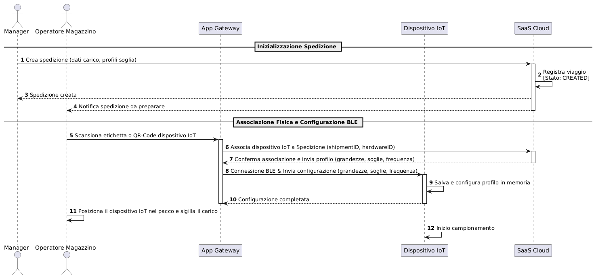
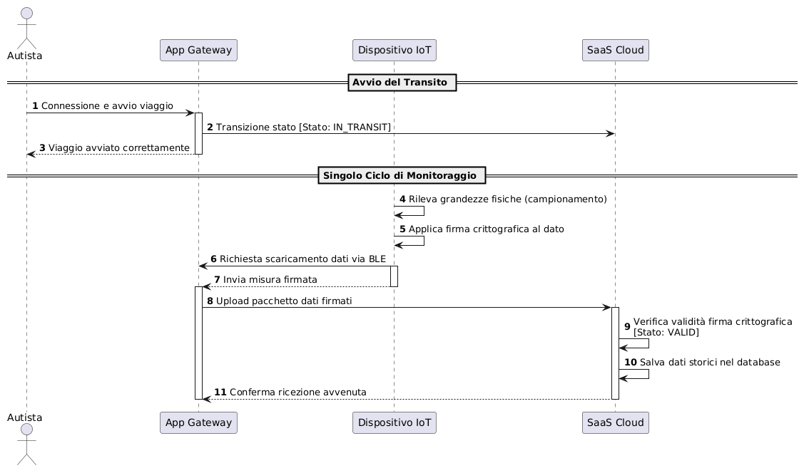
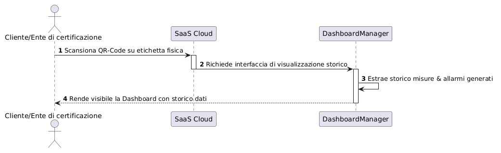

# REPORT DETTAGLIATO DI DIAGRAMMI E SPECIFICA DEI REQUISITI

## Indice
1. [INTRODUZIONE](##1.-introduzione)   
	1.1 [Requisiti di sistema](###1.1-requisiti-di-sistema)  
	1.2 [Sommario definizioni dei diagrammi](###1.2-sommario-definizioni-dei-diagrammi)  
	1.3 [Prima vista sul sistema](###1.3-sequence-diagrams-pre)  
	1.3.1 [Inizializzazione spedizione](####1.3.a-inizializzazione-spedizione)  
	1.3.2 [Tracciamento in transito](####1.3.b-tracciamento-in-transito)  
	1.3.3 [Visualizzazione finale](####1.3.c-visualizzazione-finale)

## 1. INTRODUZIONE
### 1.1 Requisiti di sistema
Il System-To-Be nasce per rispondere alle criticità della logistica delle merci fragili e deperibili (come farmaci, alimentari freschi e opere d'arte), dove la continuità della catena del freddo e la protezione da shock fisici sono requisiti vitali per l'integrità del prodotto.

L'obiettivo fondamentale del sistema è quindi istituire un meccanismo di tracciamento continuo, trasparente e matematicamente protetto da manomissioni, eliminando la necessità di basarsi sulla fiducia nei confronti dei singoli attori della catena di trasporto (vettori, autisti o operatori di magazzino). 

La descrizione in linguaggio naturale emersa con gli stakeholder è la seguente:

>Il sistema deve garantire il tracking ambientale dei prodotti tramite la registrazione e la pubblicazione periodica di parametri fisici come temperatura e umidità (ecc.), pur consentendo l'aggiunta dinamica di diverse tipologie di parametri fisici rispetto alle specifiche esigenze di trasporto.

>A tutela dell'integrità dei dati, il sistema deve applicare la firma digitale alla sorgente per la blindatura crittografica; ogni parametro ambientale rilevato dai sensori deve essere firmato digitalmente alla sorgente mediante la chiave privata del dispositivo di campionamento prima della trasmissione. Di conseguenza, il sistema non deve consentire ad alcun attore umano di modificare o cancellare i dati storici memorizzati, pena l'invalidazione matematica della firma crittografica rilevata lato Cloud.

>Il sistema deve implementare la gestione completa dei dispositivi IoT che si occupano dei campionamenti ambientali, consentendo di censirli, dismetterli, elencarli, associarli o dissociarli liberamente, oltre a configurarli per definire la frequenza di campionamento e la scelta di quali metriche raccogliere.

>Per la gestione delle spedizioni, gli attori abilitati devono poter creare, modificare, ispezionare e cancellare le spedizioni, con la possibilità di avviarle, metterle in pausa, riprenderle o arrestarle. Infine, la dashboard cloud deve evidenziare graficamente le condizioni di allarme out of range per i parametri fuori norma e deve rendere i dati costantemente accessibili a quattro categorie distinte di utenti, ovvero manager, autisti, consumatori e enti di certificazione.

>Per i vincoli non funzionali, i dispositivi IoT devono essere dispositivi low-cost e riutilizzabili per spedizioni e merci differenti. Tali dispositivi devono funzionare esclusivamente a batteria e non devono possedere accesso diretto ad internet, escludendo l'uso di Wifi, 5G o 4G, e devono comunicare tramite metodi a basso consumo energetico come il Bluetooth Low Energy (BLE). Il sistema deve inoltre monitorare lo stato di carica della batteria del dispositivo e inviare notifiche quando il livello è basso, mentre a livello infrastrutturale la piattaforma deve poggiare su un'architettura SaaS cloud erogata come servizio per la gestione e la visualizzazione dei dati.

> Il sistema deve infine implementare l'interoperabilità esponendo interfacce web (API) per consentire lo scambio sicuro e trasparente dei dati con applicativi ed enti terzi. 

A fronte di queste specifiche, si è reso necessario vincolare ulteriormente la progettazione con delle scelte architetturali da considerare come proposta effettiva di implementazione preliminare, sempre nel rispetto dei requisiti espressi. Di seguito quanto deciso:
       
    - livello batteria basso: il livello batteria è considerato basso sotto al 15%;
    - ponte di trasmissione: per supportare un flusso dati sensore --> cloud, dove sensore per requisito vincolante è privo di connessione internet, si è scelto di utilizzare lo smartphone aziendale degli attori umani coinvolti nella spedizione, autista e vari operatori di magazzino, come ponte tra connessione BLE del sensore e connessione internet per il cloud. Il flusso di dati diventa quindi:
    Sensore ---BLE---> Smartphone Autista/Magazziniere ---4G/5G/Wi-Fi--> Cloud Saas;
    - metodo di esposizione ai consumatori: il metodo principale di esposizione dati ai consumatori è tramite QrCode stampato sull'etichetta del prodotto;
    - suddivisione dei ruoli: viene fatta una precisa distinzione dei ruoli per quanto riguarda gli attori umani; per coerenza, essa è riportata in 1.2 Sommario definizioni dei diagrammi;   		

***Nota Bene: questo documento funge da reportistica e spiegazione dei diagrammi volti a raccontare la soluzione proposta del sistema; non si tratta, tuttavia, di un documento rigido e formale come il Document Requirements (RD), fornito in congiunta con questo; assunzioni, dominio, ipotesi di dominio, nomenclatura rigida e nomenclatura requisiti, infatti, NON verranno trattate nel presente documento.***

### 1.2 Sommario definizioni dei diagrammi
La seguente tabella funge da dizionario terminologico d'appoggio per i componenti e le entità specifici di questo report. La tabella è popolata seguendo un approccio incrementale, ossia in ordine di comparsa dei concetti descritti.

---
| Termine/Nome | Definizione | Ruolo nel Sistema |
| :--- | :--- | :--- |
| **Manager** | Attore umano | Utente amministrativo di alto livello della piattaforma. Gestisce le spedizioni, definendo i lotti di merce fragile, le regole di soglia e le relative grandezze da misurare, controllando lo stato complessivo dei trasporti dal portale web. E' l'unico attore in grado di creare e cancellare le spedizioni, oltre che aggiungere o rimuovere i dispositivi IoT dal sistema |
| **Autista** | Attore umano | Il conducente del mezzo di trasporto incaricato della movimentazione delle merci fragili lungo la tratta. Interagisce col sistema esclusivamente tramite l'interfaccia dell'applicazione mobile, la quale gli permette di monitorare eventuali anomalie ed eventualmente intervenire. Può fermare temporaneamente una spedizione (pause) e riprenderla, ma solo a livello logico (stato software), non fisico (il campionamento dei dati è continuo). |
| **Operatore di magazzino** | Attore umano | E' l'addetto alla logistica presente fisicamente nel centro di spedizione iniziale e finale. Si occupa del confezionamento dei colli, della scansione dei codici identificativi per l'associazione iniziale (e disassociazione finale) dei dispositivi IoT rispetto alla spedizione, e del loro posizionamento all'interno dei pacchi prima della partenza. Eseguo la prima (partenza) e l'ultima (arrivo) connessione BLE con i dispositivi IoT, per eseguire il passaggio dei dati di configurazione impostati dall'attore manager, e garantire che il flusso di dati sia avvviato (o concluso) correttamente. |
| **Consumatore/Ente di certificazione** | Attore umano | Sono i destinatari finale della spedizione fragile o l'ispettore terzo dell'autorità di qualità. Devono poter verificare la catena di approvigionamento e conformità del viaggio del pacco, accedendo alla visualizzazione dei dati |
| **AppGateway** (o **App Gateway**) | Macro-componente software | L'applicazione mobile installata sul telefono aziendale di Autista e Operatore di magazzino. Agisce come gateway intelligente sul campo, rilevando i dispositivi IoT via BLE, scaricando le letture nel buffer locale e caricando asincronamente sul Cloud. Funge da gateway anche nella direzione inversa, condividendo i dati di configurazione inziali provenienti dal Cloud al dispositivo IoT. Inoltre, gli Operatori di magazzino utilizzano AppGateway per associare (alla partenza) e disassociare (all'arrivo) il dispositivo IoT alla spedizione. |
| **Dispositivo IoT** | Macro-componente software | Il dispositivo fisico commerciale low-cost posizionato all'interno delle merci, funzionante a batteria e contenente il firmware di controllo (**OnBoardFirmware**), che gestisce e controlla batteria e stato generale del dispositivo, i trasduttori di misurazione ambientale (**PhysicalTransducer**), che si occuopano dei rilevamenti e campionamenti, e il coprocessore crittografico (**SecureElement**), con lo scopo di mettere in sicurezza i dati da trasmettere tramite chiave privata non accessibile da nessun attore/componente |
| **SaaS Cloud** | Macro-componente software | L'infrastruttura centrale erogata come servizio (SaaS). Coordina i database storici, memorizza i dati anagrafici dei viaggi, verifica matematicamente le firme dei dati arrivati e serve le dashboard web e le API esterne per la visualizzazione |
| **DashboardManager** | Sotto-componente software | Sotto-componente specifico del SaaS Cloud dedicato alla gestione dell'allarmistica e del rendering grafico interattivo dei dati |

---

### 1.3 Prima vista sul sistema (Sequence Diagrams PRE)
Prima di procedere all'inquadramento dettagliato dei singoli goal derivanti dai requisiti, il sistema è stato analizzato "a scatola chiusa" dal punto di vista comportamentale. Questa prima analisi ad alto livello è modellata attraverso tre Sequence Diagram preliminari, che descrivono i flussi e le interazioni macroscopiche tra gli attori umani e le macro-entità tecnologiche del sistema, al fine di definire un esatto match tra le due componenti (umane-software). Definiamo quindi nella tabella a ***1.2 Sommario definizioni dei diagrammi*** le prime componenti utili: **Manager**, **Autista**, **Operatore di magazzino**, **Consumatore/Ente di certificazione**.

#### 1.3.a Inizializzazione spedizione
Questo primo flusso descrive le operazioni preparatorie che avvengono prima dell'effettiva partenza del carico. Il **Manager** registra a sistema la spedizione impostando i dati logistici ed i vincoli fisici di conservazione (grandezze, soglie, frequenza di campionamento), creando così la spedizione a sistema. Successivamente, l'**Operatore di magazzino** effettua l'associazione del dispositivo IoT tramite l'applicazione mobile, **AppGateway**, scansionando l'identificativo del dispositivo e, tramite accoppiamento automatico Bluetooth, scaricando i parametri configurati per la spedizione. Una volta completata questa prima connessione, il dispositivo IoT viene inserito e sigillato all'interno del collo.

---

---

#### 1.3.b Tracciamento in transito

Il secondo flusso si focalizza sulla dinamica temporale del viaggio e sulla gestione dei dati. Descrive il comportamento ciclico del dispositivo IoT che campiona l'ambiente e, in totale autonomia, firma digitalmente le misure grazie al chip crittografico integrato, chiamato **SecureElement**. Mostra inoltre la gestione asincrona del canale Bluetooth: l'applicazione sul telefono dell'autista **AppGateway** rileva periodicamente la connessione BLE a corto raggio, ne scarica le letture accumulate svuotando la memoria fisica del dispositivo IoT, e non appena la connettività di rete cellulare lo consente (4G/5G/Wi-fi), invia i dati a **SaaS Cloud**. 

In questo diagramma preliminare si introduce anche il concetto di verifica dell'integrità: il server **SaaS Cloud** decifra le firme e, in caso di discrepanze o dati manomessi lungo il percorso, solleva immediatamente un allarme visivo sulla dashboard amministrativa, **DashboardManager**. Il diagramma tuttavia rappresenta uno scenario positivo di base.

---

---

***Nota Bene: per semplicità di rappresentazione, considerando che si tratta della primissima vista sul sistema, abbiamo preferito non utilizzare costrutti più complessi come alt o loop, preferendo la chiarezza immediata del flusso generale.***

#### 1.3.c Visualizzazione finale

Questo terzo ed ultimo flusso preliminare racconta l'esposizione trasparente dei dati: una volta terminato il viaggio, i destinatari, ossia il **Consumatore** o l'**Ente di certificazione**, possono verificare la conformità dell'intera spedizione scansionando un QRCode posto sul prodotto finale. La scansione indirizza ad una pagina web sicura ospitata sulla piattaforma cloud SaaS. Il sistema interroga dunque il database storico verificato e restituisce una dashboard riassuntiva che certifica la qualità del viaggio, presentando eventuali allarmi e violazioni emerse durante l'intera catena di approvigionamento. 

---

---

!!!!!!!!!aggiungere piccolo diagramma o tabella di ereditarietà tra agenti?

